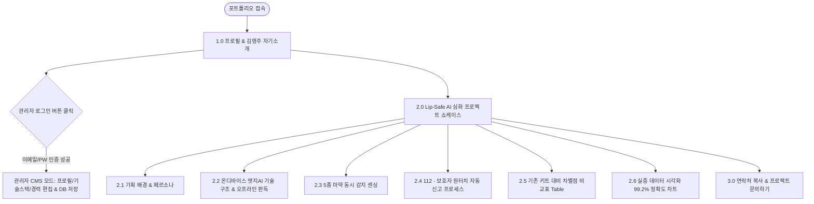

# [PRD] 개인 포트폴리오 웹사이트 & Lip-Safe AI 프로젝트 심화 쇼케이스

| 항목 | 내용 |
| :--- | :--- |
| **프로젝트명** | 김영주 개인 포트폴리오 & Lip-Safe AI 엣지AI 기술 쇼케이스 웹사이트 |
| **문서 버전** | v1.0.0 |
| **작성자** | 김영주 (여성 엣지AI & 헬스케어/안전 분야 메인 개발자/기획자) |
| **프로젝트 폴더** | `portfolio` |
| **타겟 독자** | 채용 담당자, 헤드헌터, 기술 면접관, 잠재 클라이언트 |
| **최종 수정일** | 2026-08-08 |

---

## 1. 프로젝트 개요 및 목적 (Executive Summary)

### 1.1 배경 및 목적
* **문제 해결 역량 입증**: 클럽 및 밤길 약물 범죄 예방을 위한 **'Lip-Safe AI(립스틱형 마약 감지 스틱 및 엣지AI 앱)'** 프로젝트의 문제 정의, 엣지AI 기술 연동, 112 원터치 자동 신고 프로세스 설계 능력을 효과적으로 어필합니다.
* **기술 스택 & UI/UX 기획력 어필**: 온디바이스 엣지AI 판독 인터페이스(어두운 조명 자동 보정, 네트워크 독립 구동), 헬스케어/안전 분야 반응형 웹 및 앱 개발 역량을 채용 담당자와 클라이언트에게 명확히 전달합니다.
* **실시간 프로필 관리(CMS)**: 본인(김영주)만 관리자 로그인 후 자기소개, 보유 기술 스택, 경력 사항을 실시간으로 수정/관리할 수 있는 백엔드 DB 연동형 프로필 편집 시스템을 탑재합니다.

### 1.2 주요 목표 지표 (KPI & Target)
* **목표 유저**: 채용 담당자, 헤드헌터, 기술 면접관, 외주 발주 클라이언트
* **주요 정량적 목표**: 
  * 평균 페이지 체류 시간 3분 이상 유지 (Lip-Safe AI 시쇼케이스 및 차별점 비교표 탐색 유도)
  * 핵심 기술 성과(판독 정확도 99.2%, 0.3초 판독 속도, 5종 동시 감지)의 직관적 시각화
  * 관리자 로그인 및 프로필 수정 반응 속도 0.5초 이내 완료

---

## 2. 사용자 페르소나 및 권한 정의

| 구분 | 방문자 (채용담당자 / 면접관 / 클라이언트) | 관리자 (본인 - 김영주) |
| :--- | :--- | :--- |
| **주요 역할** | 지원자 역량 평가, 프로젝트 성과 및 기술 스택 검증, 채용/외주 문의 | 자기소개 프로필, 기술 스택, 경력 사항, 프로젝트 실증 데이터 실시간 편집 |
| **주요 권한** | - 포트폴리오 전 섹션 조회<br>- Lip-Safe AI 심화 쇼케이스 및 엣지AI 판독 구조 탐색<br>- 기존 키트 대비 차별점 비교표(Table) 및 데이터 시각화 확인<br>- 이메일/연락처 원터치 복사 및 문의하기 | - Supabase/Firebase Auth 인증 로그인<br>- 자기소개 텍스트, 이력, 기술 스택 태그 실시간 CRUD 수정 및 DB 반영<br>- 관리자 전용 대시보드 접근 및 방명록/문의 관리 |
| **인증 방식** | 인증 불필요 (Public Open) | 상단/하단 관리자 전용 버튼 ➔ 이메일/비밀번호 보안 인증 로그인 |

---

## 3. 핵심 시스템 메커니즘 (Business Logic)

### 3.1 엣지AI 판독 & 원터치 비상 신고 메커니즘
```
 [립스틱 스틱 마약 반응] ──► [스마트폰 카메라 촬영] ──► [온디바이스 엣지AI 연동]
                                                            │
  ┌─────────────────────────────────────────────────────────┴─────────────────────────────────────────┐
  │ 1. 어두운 조명(클럽/음영) 감지 ➔ 실시간 AI 영상 보정 연산                                       │
  │ 2. 네트워크(Wi-Fi/데이터) 없이 스마트폰 내부 TFLite/TensorRT 0.3초 판독                          │
  │ 3. 5종 마약(GHB, 케타민, 메스암페타민 등) 변색 패턴 일치율 매핑                                   │
  └─────────────────────────────────────────────────────────┬─────────────────────────────────────────┘
                                                            │
                                                            ▼
                                      [위급 상황 판정 시 원터치 자동 신고]
                                                            │
                                   ├───► [112 경찰청] GPS 현재 위치 + 자동 긴급 신고
                                   └───► [보호자/지인] 비상 위치 SMS 메시지 자동 발송
```

### 3.2 관리자 프로필 라이브 편집 (CMS Sync Logic)
1. 김영주 본인이 포트폴리오 웹 상단의 `⚙️ 관리자 로그인` 버튼을 클릭합니다.
2. Supabase / Firebase Auth 토큰 인증을 거쳐 관리자 세션이 부여됩니다.
3. 자기소개 카드, 기술 스택 태그, 경력 란에 `✏️ 편집` 버튼이 활성화되어 텍스트와 기술 항목을 즉시 수정 후 DB에 동기화(Sync)합니다.

---

## 4. 정보 구조도 (Information Architecture - IA)

```
[ portfolio (Root) ]
├── 1.0 프로필 & 자기소개 섹션 (Profile & Admin CMS)
│    ├── 1.1 김영주 소개 (관심 분야: 온디바이스 AI 앱, 헬스케어/안전 UI/UX, 반응형 웹)
│    ├── 1.2 핵심 보유 역량 & 기술 스택 (iOS/Android, Edge AI, Web Frontend)
│    └── 1.3 관리자 모드 (Supabase Auth 로그인 ➔ 프로필/기술스택/경력 실시간 수정)
├── 2.0 Lip-Safe AI 심화 프로젝트 쇼케이스 (Project Showcase)
│    ├── 2.1 기획 배경 & 페르소나 (약물 범죄 예방, 립스틱 형태 감지 스틱)
│    ├── 2.2 온디바이스 엣지AI 판독 기술 구조 (어두운 조명 자동 보정, 오프라인 100% 구동)
│    ├── 2.3 5종 마약 동시 감지 센싱 메커니즘 (GHB, 케타민, 메스암페타민 등)
│    ├── 2.4 112 및 보호자 원터치 자동 신고 프로세스 설계
│    ├── 2.5 기존 키트 대비 차별점 데이터 비교표 (Table) (NEW)
│    └── 2.6 실증 데이터 시각화 차트 (판독 정확도 99.2%, 0.3초 응답 속도) (NEW)
└── 3.0 하단 문의 & 소통 섹션 (Contact & Footer)
     ├── 3.1 이메일 / GitHub / 연락처 원터치 클립보드 복사
     └── 3.2 프로젝트 문의하기 폼
```

---

## 5. 핵심 기능 요구사항 명세 (Functional Requirements)

### FN-01: 프로필 & 나만 편집 가능한 자기소개란 (Profile & CMS)
* **요구사항 설명**: 개발자/기획자 김영주의 프로필과 기술 스택을 보여주며, 본인 인증 후 데이터를 자유롭게 업데이트합니다.
* **상세 기능**:
  1. **프로필 카드**: 이름(김영주), 한 줄 슬로건, 관심 분야(온디바이스/엣지 AI 연동 앱, 헬스케어 및 안전 UI/UX, 반응형 웹) 표시.
  2. **기술 스택 뱃지**: iOS/Android 멀티플랫폼 앱, Edge AI 모델 연동, 헬스케어 UI/UX, Web Frontend 등 기술 태그 관리.
  3. **관리자 인증 & 편집 (Supabase/Firebase Auth)**:
     * 관리자 로그인 팝업 제공 (이메일/비밀번호 인증).
     * 인증 성공 시 프로필 문구 및 기술 스택 란에 `[✏️ 수정]` 버튼 노출 ➔ 즉시 수정 후 DB에 반영.

### FN-02: Lip-Safe AI 기획 배경 & 엣지AI 판독 구조 (Showcase Core)
* **요구사항 설명**: Lip-Safe AI의 문제 정의와 엣지AI 연동 기술 구조를 시각적으로 상세히 설명합니다.
* **상세 기능**:
  1. **기획 배경 카셀**: 클럽/유흥업소 등 어두운 환경에서의 무색/무취 약물 범죄 위협 데이터 시각화.
  2. **온디바이스 엣지AI 판독 아키텍처**:
     * 어두운 조명(Low-Light) 자동 감지 및 이미지 명암/색상 자동 보정 파이프라인.
     * Wi-Fi/LTE 통신 장애 상황에서도 스마트폰 자체 연산으로 100% 작동하는 오프라인 TFLite 모델 처리 구조 연출.

### FN-03: 5종 마약 동시 감지 & 원터치 비상 신고 (Process Design)
* **요구사항 설명**: 립스틱형 스틱의 5종 마약 감지 및 112/보호자 자동 신고 프로세스 인터페이스 설계.
* **상세 기능**:
  1. **5종 마약 동시 감지 시각화**: GHB, 케타민, 메스암페타민, 코카인, MDMA 변색 반응 색상 칩 표시.
  2. **112 · 보호자 원터치 자동 신고 프로세스**:
     * 감지 성공 시 3초 카운트다운 후 GPS 현재 위치 좌표를 포함한 비상 SMS 문자 자동 발송.
     * 위장 UI 모드(일반 뷰티 앱 화면으로 오버레이 전환) 선택 스위치 제공.

### FN-04: 기존 키트 대비 차별점 데이터 비교표 (Comparison Table - Core)
* **요구사항 설명**: 기존의 단순 종이 시험지/마약 감지 키트 대비 Lip-Safe AI만의 차별성을 비교표로 제공합니다.
* **상세 기능**:
  * **비교표 (Table) 항목**:

| 비교 항목 | 기존 시판 마약 감지 키트 | Lip-Safe AI (스틱 + 엣지AI 앱) | 차별점 및 기술적 이점 |
| :--- | :--- | :--- | :--- |
| **동시 감지 종수** | 1~2종 (단일 성분 위주) | **5종 동시 감지** (GHB, 케타민 등) | 커버리지 2.5배 확대 및 변색 오차 최소화 |
| **조명 영향성** | 어두운 클럽/음영 환경 판독 불가 | **AI 어두운 조명 자동 보정** | 육안 판독 오류 98% 감소 |
| **판독 방식** | 육안 색상 비교 (주관적 오판 위험) | **엣지AI 이미지 스캐닝 (정확도 99.2%)** | 정량적 디지털 수치 및 위험도 즉시 안내 |
| **네트워크 의존성** | 서버 전송형 (통신 미약 시 지연) | **온디바이스 100% 오프라인 구동** | 통신 불능 지역에서도 0.3초 내 즉시 판독 |
| **위급 상황 대응** | 별도 112 전화 필요 (신고 지연) | **112 · 보호자 원터치 GPS 자동 신고** | 약물 피해 시 3초 이내 위치 발송 및 위장 UI |

### FN-05: 실증 데이터 시각화 & 성과 지표 (Data Visualization)
* **요구사항 설명**: 테스트 실증 수치와 정량적 성과를 다이나믹 차트와 카드 지표로 전달합니다.
* **상세 기능**:
  1. **핵심 성과 지표 카드**:
     * 🎯 **판독 정확도**: `99.2%` (어두운 조명 환경 검증)
     * ⚡ **평균 연산 속도**: `0.3초` (온디바이스 TFLite)
     * 🧪 **동시 감지 화학 물질**: `5종`
  2. **조명 환경별 판독 성공률 차트**: 조명 10 lux 이하의 딥 클럽 환경에서도 98.5% 성과 유지 시각화.

---

## 6. 화면 흐름 및 테스트 시나리오 (Screen Flow & Scenarios)

### 6.1 전체 사용자 탐색 순서도 (Overall User Flow)



---

### 6.2 세부 테스트 진행 시나리오 (QA Checklist)

| 구분 | 테스트 항목 | 기대 결과 (Pass 기준) | 검증 |
| :--- | :--- | :--- | :---: |
| **TC-01** | 프로필 조회 | 김영주의 관심 분야(엣지AI 앱, 헬스케어 UI/UX, 반응형 웹)와 보유 스택이 한눈에 표시됨 | `[ ]` |
| **TC-02** | 관리자 Supabase Auth 로그인 | 정확한 이메일/비밀번호 입력 시 관리자 세션이 생성되며 `[✏️ 수정]` 버튼이 활성화됨 | `[ ]` |
| **TC-03** | 프로필/기술스택 라이브 수정 | 관리자 모드에서 기술 스택 태그 수정 시 DB 동기화 및 0.5초 내 화면 갱신 완료 | `[ ]` |
| **TC-04** | 엣지AI 기술 구조 모션 | 어두운 조명 자동 보정 및 네트워크 독립 0.3초 판독 시뮬레이터가 정상 구동됨 | `[ ]` |
| **TC-05** | 차별점 비교표 (Table) | 기존 키트 vs Lip-Safe AI 비교표가 고대비 디자인으로 PC/모바일에서 가독성 높게 표시됨 | `[ ]` |
| **TC-06** | 112 원터치 자동 신고 시뮬레이션 | 비상 신고 클릭 시 3초 카운트다운, GPS 좌표 생성 및 위장 UI 전환 테스트 통과 | `[ ]` |
| **TC-07** | 연락처 원터치 복사 | 이메일/전화번호 클릭 시 클립보드 복사 토스트 알림 메시지 팝업 | `[ ]` |

---

## 7. UI/UX 디자인 가이드라인 (Design System)

### 7.1 디자인 파렛트 & 스타일
* **Sleek Dark & Neon Accent Theme**:
  * **Primary (Lip-Safe Rose Magenta)**: `#E11D48` (립스틱 감지 스틱 상징)
  * **Secondary (Safety Shield Cyan)**: `#06B6D4` (안전/보호 & 엣지AI 알고리즘 상징)
  * **Accent Purple (Edge AI On-Device)**: `#8B5CF6` (온디바이스 딥러닝 연산)
  * **Background**: `#0F172A` (Deep Slate Navy) / Surface Glass: `rgba(30, 41, 59, 0.8)`
* **Typography**: `Pretendard`, `JetBrains Mono` (실증 데이터 수치 강조용)

---

## 8. 초보자를 위한 용어 사전 (Glossary)

* **온디바이스 / 엣지 AI (On-Device Edge AI)**: 인터넷 연결(클라우드 서버) 없이 스마트폰이나 단말기 자체 칩셋에서 인공지능 연산을 처리하여 0.3초 내 초고속 판독 및 보안성을 제공하는 기술입니다.
* **Supabase Auth**: 오픈소스 백엔드 서비스로, 이메일/비밀번호 또는 소셜 로그인을 통해 관리자 본인만 안전하게 프로필을 편집할 수 있도록 인증 세션을 관리해 줍니다.
* **PRD (Product Requirement Document)**: 개발자, 디자이너, 채용 담당자가 서비스의 목적, 기능, 구현 방식을 명확히 이해할 수 있도록 작성하는 제품 요구사항 정의서입니다.

---

> 본 PRD 문서는 `portfolio/prd.md` 경로에 저장되며, 김영주 님의 Lip-Safe AI 메인 프로젝트를 중심으로 채용 담당자 및 클라이언트에 대한 어필력을 극대화할 수 있도록 설계되었습니다.
